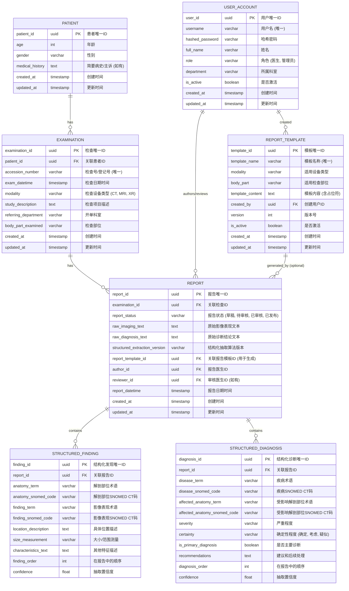

# 医学影像智能报告系统 - 项目详细开发方案

## 1. 项目目标 (Project Goals)

### 1.1 总体目标

构建一个先进的医学影像智能报告系统，核心是建立一个**双向知识体系**。该体系能够实现：

- **从原始影像报告到结构化知识的自动化采集与更新**：利用自然语言处理（NLP）和人工智能（AI）技术，从自由文本的医学影像报告中高效、准确地提取关键医学实体和信息，将其转化为标准化的结构化数据。
- **从结构化知识到标准化报告的自动化提示与生成**：基于积累的结构化知识库和可配置的报告模板，为医生提供智能化的报告编写辅助，包括自动填充、术语推荐、风险提示等，并能一键生成符合规范的影像报告。

最终目标是打造一个能够持续学习、自我完善的闭环系统，显著提升影像科医生的工作效率，规范报告质量，促进医学知识的积累与共享，并为临床科研和决策支持提供高质量的数据基础。

### 1.2 具体目标

1.  **影像报告结构化处理**：
    *   自动从影像报告文本中提取关键信息，包括但不限于：患者基本信息（年龄、性别）、检查信息（检查项目、日期）、影像表现描述（解剖部位、病灶特征、大小、数量等）、诊断结论（疾病名称、可能性、分级）。
    *   将提取的信息映射到医学标准术语体系，如SNOMED CT，实现数据的标准化和互操作性。
    *   处理主诉信息（如果报告中包含），并将其与影像发现和诊断相关联。

2.  **双向知识体系构建**：
    *   建立一个动态更新的结构化知识库，存储从报告中提取的标准化医学知识。
    *   支持从结构化知识库反向生成可定制的报告模板和文本片段。
    *   实现知识库的持续学习和优化能力，例如从新的报告模式中学习，或根据医生反馈调整模板。

3.  **报告自动化与辅助生成**：
    *   为医生提供报告编写时的智能提示，包括常用术语、标准描述、相似病例参考等。
    *   根据结构化数据和预设模板，自动生成初步的影像报告，供医生审核和修改。
    *   支持报告模板的自定义管理，满足不同科室、不同检查类型的需求。

4.  **数据分析与应用**：
    *   基于结构化的报告数据，支持对特定疾病、影像特征等的统计分析和趋势预测。
    *   为临床研究提供高质量、标准化的数据源。
    *   探索基于知识图谱的智能问答和决策支持功能。

5.  **系统集成与易用性**：
    *   提供用户友好的界面，方便医生使用各项功能。
    *   考虑与医院现有HIS/RIS/PACS系统的集成可能性。
    *   确保系统的高可用性、高安全性和高性能。 

## 2. 技术架构 (Technical Architecture)

### 2.1 整体架构概述

本系统将采用模块化、分层式的微服务架构，以确保系统的灵活性、可扩展性和可维护性。核心思想是构建一个数据驱动的智能系统，通过API接口实现各组件间的松耦合通信。

```mermaid
graph TD
    A[用户界面层] --> B{API网关};
    
    subgraph 服务层
        B --> C[报告结构化服务];
        B --> D[报告生成服务];
        B --> E[知识库管理服务];
        B --> F[用户与权限管理服务];
        B --> G[数据分析服务];
    end

    C --> H{NLP引擎};
    C --> I[SNOMED CT映射模块];
    D --> J[报告模板引擎];
    D --> H;
    E --> K{数据存储层};
    G --> K;

    subgraph 核心引擎与模型
        H[NLP与LLM引擎<br/>(实体抽取、关系识别、文本生成)];
        I[SNOMED CT映射模块<br/>(术语标准化)];
        J[报告模板引擎<br/>(模板管理与填充)];
    end

    subgraph 数据存储层
        K[数据存储<br/>(PostgreSQL/MySQL, Neo4j, Elasticsearch, 对象存储)];
    end

    L[外部系统] --> B;
    M[运维监控] --> A;
    M --> C;
    M --> D;
    M --> E;
    M --> F;
    M --> G;
    M --> K;

    style A fill:#f9f,stroke:#333,stroke-width:2px
    style L fill:#ccf,stroke:#333,stroke-width:2px
    style M fill:#f66,stroke:#333,stroke-width:2px
```

### 2.2 架构分层

1.  **用户界面层 (Interface Layer)**：
    *   **职责**：提供用户交互界面，包括Web应用（医生工作站、管理后台）和可能的移动端应用。
    *   **技术选型**：前端框架（如React, Vue, or Angular），UI组件库（如Ant Design, Element UI）。

2.  **应用层/服务层 (Application/Service Layer)**：
    *   **职责**：处理业务逻辑，提供核心功能服务。通过API网关对外暴露接口。
    *   **主要服务**：
        *   **报告结构化服务 (Report Structuring Service)**：负责接收原始报告文本，调用NLP引擎和SNOMED CT映射模块，输出结构化数据。
        *   **报告生成服务 (Report Generation Service)**：根据结构化数据和模板，调用NLP引擎生成报告文本。
        *   **知识库管理服务 (Knowledge Base Management Service)**：负责结构化知识的存储、检索、更新和版本管理。
        *   **用户与权限管理服务 (User & Permission Management Service)**：处理用户认证、授权和角色管理。
        *   **数据分析服务 (Data Analytics Service)**：提供基于结构化数据的统计分析和可视化功能。
        *   **模板管理服务 (Template Management Service)**：允许用户创建、编辑和管理报告模板。
    *   **技术选型**：后端框架（如FastAPI (Python), Spring Boot (Java)），API网关（如Kong, Nginx）。

3.  **核心引擎与模型层 (Core Engine & Model Layer)**：
    *   **职责**：提供底层的智能处理能力。
    *   **主要组件**：
        *   **NLP与LLM引擎**：执行医学实体识别、关系抽取、语义理解、文本生成等任务。可集成通用大语言模型（如GPT系列、Claude系列）并进行医学领域微调，或使用医学专用LLM。
        *   **SNOMED CT映射模块**：将从文本中提取的医学术语与SNOMED CT标准编码进行匹配和映射。
        *   **报告模板引擎**：管理和渲染报告模板，支持动态内容填充。
    *   **技术选型**：Python生态（Transformers, spaCy, NLTK），机器学习框架（PyTorch, TensorFlow）。

4.  **数据存储层 (Data Storage Layer)**：
    *   **职责**：持久化存储系统所需的各类数据。
    *   **主要数据类型与存储方案**：
        *   **结构化报告数据/业务数据**：关系型数据库（PostgreSQL, MySQL）存储患者信息、检查信息、用户信息、结构化字段等。
        *   **医学知识图谱**：图数据库（Neo4j）存储SNOMED CT概念、医学实体间的关系、推理规则等。
        *   **原始报告文本与日志**：文档数据库或搜索引擎（Elasticsearch, MongoDB）用于高效检索和分析非结构化文本。
        *   **模型与模板文件**：对象存储（如MinIO, AWS S3）或文件系统。
        *   **缓存数据**：内存数据库（Redis）用于缓存常用数据和会话信息，提升性能。

5.  **基础设施与运维 (Infrastructure & Operations)**：
    *   **职责**：提供系统运行所需的基础设施，并保障系统的稳定运行。
    *   **技术选型**：容器化（Docker），容器编排（Kubernetes），CI/CD流水线（Jenkins, GitLab CI），监控与告警（Prometheus, Grafana, ELK Stack）。

### 2.3 技术选型初步考虑

*   **后端开发语言**：Python (凭借其丰富的AI/NLP库和快速开发能力)
*   **Web框架**：FastAPI (高性能Python Web框架，自带数据校验和API文档生成)
*   **前端框架**：React 或 Vue.js (根据团队熟悉度和生态选择)
*   **NLP/LLM引擎**：
    *   基于Transformer的预训练模型（如BERT, GPT系列，或医学专用模型如BioBERT, MedBERT, ChatGLM-Med, Qwen-Med）。
    *   考虑使用成熟的LLM API服务（如OpenAI API, Claude API）或私有化部署开源LLM。
*   **数据库**：
    *   **关系型数据库**：PostgreSQL (功能强大，开源，适合复杂查询和事务处理)
    *   **图数据库**：Neo4j (行业领先的图数据库，适合知识图谱构建和关系分析)
    *   **搜索引擎/文档库**：Elasticsearch (强大的全文检索和分析能力)
    *   **缓存**: Redis
*   **SNOMED CT集成**：
    *   考虑使用官方提供的SNOMED CT浏览器API。
    *   或者，将SNOMED CT的RF2文件导入本地数据库（如图数据库或关系型数据库）以供查询和映射。
*   **消息队列**：RabbitMQ 或 Kafka (用于服务间的异步通信和任务解耦，如报告处理任务)。
*   **容器化与编排**：Docker, Kubernetes。

### 2.4 关键技术挑战与应对

*   **医学术语的准确识别与标准化**：
    *   **挑战**：医学术语多样性、缩写、别名、上下文依赖。
    *   **应对**：高质量LLM微调，结合SNOMED CT多维度映射策略（精确、模糊、语义），引入人工审核与反馈机制。
*   **知识图谱的构建与维护**：
    *   **挑战**：从文本自动构建高质量知识图谱的复杂性，图谱的动态更新。
    *   **应对**：分阶段构建，先核心后扩展；设计合理的图数据模型；结合规则与机器学习方法进行图谱推理和补全。
*   **LLM的可解释性与可靠性**：
    *   **挑战**：LLM的"黑箱"特性，可能产生幻觉或不准确输出。
    *   **应对**：设计验证模块对LLM输出进行交叉验证；提供置信度评估；关键诊断和建议需医生审核。
*   **系统性能与扩展性**：
    *   **挑战**：大量报告处理可能带来的性能瓶颈。
    *   **应对**：采用微服务架构，异步处理，优化数据库查询，利用缓存，水平扩展关键服务。
*   **数据安全与隐私保护**：
    *   **挑战**：处理敏感的医疗数据。
    *   **应对**：严格遵守HIPAA、GDPR等相关法规；数据脱敏、加密存储、访问控制、操作审计。 

## 3. 实施步骤 (Implementation Steps)

本项目的实施将遵循敏捷开发原则，通过迭代方式逐步完善系统功能，确保快速响应需求变化并持续交付价值。初步划分为以下几个主要阶段：

### 阶段一：项目启动与规划 (1-2周)

1.  **团队组建与角色分配**：
    *   明确项目经理、产品负责人、前后端工程师、AI工程师、测试工程师、UI/UX设计师等核心角色和职责。
2.  **详细需求分析与确认**：
    *   与影像科医生、医院信息科等关键干系人进行深入沟通，收集并细化用户需求、业务流程、集成需求。
    *   梳理现有数据资源（如华西胸部CT报告、绥化报告模板等），明确数据清洗、预处理方案。
    *   确认SNOMED CT等医学术语标准的获取方式和版本。
3.  **技术选型最终确认**：
    *   基于初步技术选型，进行更详细的评估和PoC验证，最终确定各层级技术栈。
4.  **制定详细项目计划**：
    *   制定详细的迭代计划、里程碑、交付物清单和时间表。
    *   建立项目管理和沟通机制（如每日站会、周报、JIRA/Confluence等）。
5.  **搭建开发与测试环境**：
    *   配置代码仓库、CI/CD流水线、开发、测试及预生产环境。

### 阶段二：核心功能开发 - PoC与MVP (6-8周)

此阶段重点是快速实现核心的"报告结构化"和"知识库构建"功能，并验证关键技术的可行性。

1.  **数据模型与数据库设计落地** (并行)：
    *   完成关系型数据库（如PostgreSQL）的表结构设计，存储患者信息、检查信息、结构化报告字段等。
    *   完成图数据库（如Neo4j）的初步模型设计，用于存储SNOMED CT概念和医学实体关系。
2.  **PoC：LLM实体抽取与SNOMED CT映射** (迭代1-2):
    *   **目标**：验证从影像报告文本中（基于`08_data`中的样例）提取关键医学实体（如疾病、解剖部位、病灶特征）并映射到SNOMED CT的可行性与初步效果。
    *   开发基础的NLP服务，集成选定的LLM。
    *   实现一个简化的SNOMED CT映射模块（可先基于关键词匹配或小型词典）。
    *   构建小规模标注数据集，对LLM进行初步微调或Prompt工程优化。
    *   评估实体抽取的准确率、召回率和F1分数。
3.  **MVP：报告结构化服务与知识库初步构建** (迭代3-4):
    *   基于PoC成果，开发V1.0报告结构化服务API。
    *   将结构化后的数据存入关系型数据库和图数据库，形成初步的知识库。
    *   开发基础的知识库管理接口（增删改查）。
    *   实现一个简单的管理界面，用于查看结构化结果和人工校验。
    *   **产出**：能够处理上传的影像报告文本，输出结构化数据，并存入知识库。

### 阶段三：报告生成与双向闭环构建 (6-8周)

在结构化能力基础上，构建报告生成能力，形成双向知识流动的初步闭环。

1.  **报告模板引擎开发** (迭代5):
    *   设计并实现报告模板管理功能，支持创建、编辑、版本控制不同检查类型的报告模板。
    *   模板支持占位符和简单逻辑判断。
2.  **报告生成服务开发** (迭代6-7):
    *   实现根据结构化数据和选定模板自动填充生成报告初稿的功能。
    *   集成NLP/LLM引擎，用于生成更自然的描述性文本，或对模板内容进行润色。
    *   提供API接口供前端调用。
3.  **初步双向流程打通与优化** (迭代8):
    *   将"报告结构化"和"报告生成"流程连接起来，验证数据在系统内的双向流动。
    *   优化LLM抽取和生成模型的准确性和效率。
    *   完善知识库的更新机制，例如从医生修改过的生成报告中学习。
    *   **产出**：系统具备从文本报告到结构化知识，再从结构化知识辅助生成新报告的基本能力。

### 阶段四：高级功能与系统完善 (8-10周)

扩展更多高级功能，并对系统进行全面测试和优化。

1.  **高级NLP功能** (并行):
    *   语义理解增强：如上下文关联、否定词处理、时间序列分析。
    *   关系抽取：识别实体间的复杂关系，丰富知识图谱。
    *   智能问答：基于知识库的初步问答能力探索。
2.  **数据分析与可视化模块** (迭代9-10):
    *   开发数据统计和分析功能，如特定疾病的检出率、影像特征分布等。
    *   提供可视化图表展示分析结果。
3.  **用户与权限管理模块** (迭代11):
    *   实现用户注册、登录、角色管理、数据访问权限控制。
4.  **系统集成与接口完善** (迭代12):
    *   根据需求，开发与HIS/RIS/PACS等外部系统的数据接口。
    *   完善API文档和开发者支持。
5.  **全面测试与性能优化**:
    *   进行单元测试、集成测试、系统测试和UAT用户验收测试。
    *   性能测试、安全测试、兼容性测试。
    *   根据测试结果进行代码优化和缺陷修复。
    *   **产出**：功能完整、性能稳定、安全可靠的医学影像智能报告系统V1.0。

### 阶段五：部署、培训与上线 (2-4周)

1.  **生产环境部署**：
    *   配置生产服务器、数据库、网络等基础设施。
    *   部署系统应用和服务。
2.  **数据迁移与初始化** (如需)：
    *   将历史数据导入新系统。
3.  **用户培训**：
    *   为影像科医生、技师、管理员等提供系统操作培训。
    *   编写用户手册和操作指南。
4.  **试运行与反馈收集**：
    *   在小范围科室进行试运行，收集用户反馈。
    *   根据反馈进行快速调整和优化。
5.  **正式上线与切换**。

### 阶段六：持续运维与迭代优化 (长期)

1.  **系统监控与维护**：
    *   7x24小时监控系统运行状态，及时处理故障。
    *   定期进行数据备份和系统维护。
2.  **用户支持与问题响应**：
    *   提供技术支持渠道，解答用户疑问，处理使用问题。
3.  **功能迭代与升级**：
    *   根据用户反馈和业务发展需求，持续规划和开发新功能。
    *   定期发布版本更新和补丁修复。
4.  **模型与知识库的持续优化**：
    *   定期对NLP/LLM模型进行再训练和优化。
    *   持续扩充和完善医学知识库和报告模板库。

**注**：以上时间预估仅供参考，具体排期需根据团队规模、技术复杂度及实际需求进行调整。每个迭代周期建议为2-3周。 

## 4. 数据库设计 (Database Design)

系统将采用混合数据存储方案，以满足不同类型数据的存储和查询需求。主要包括关系型数据库、图数据库和文档型数据库/搜索引擎。

### 4.1 关系型数据库 (PostgreSQL)

用于存储结构化的业务数据，如患者信息、检查信息、用户信息、结构化报告内容、报告模板等。以下是核心表的初步设计：



**关键表说明**：

*   **PATIENT**: 存储患者的基本人口学信息。
*   **EXAMINATION**: 记录每一次影像检查的详细信息。
*   **REPORT**: 核心表，存储原始报告文本、关联的结构化信息、报告状态和元数据。
*   **STRUCTURED_FINDING**: 存储从"影像表现"中提取的每一条结构化发现，包括涉及的解剖部位、影像特征、测量值等，并关联SNOMED CT编码。
*   **STRUCTURED_DIAGNOSIS**: 存储从"诊断结论"中提取的每一条结构化诊断，包括疾病名称、受影响部位、严重程度、确定性等，并关联SNOMED CT编码。
*   **USER_ACCOUNT**: 管理系统用户信息和权限。
*   **REPORT_TEMPLATE**: 存储用户自定义的报告模板。

### 4.2 图数据库 (Neo4j)

用于构建和存储医学知识图谱，核心是SNOMED CT的本体结构以及从报告中学习到的医学实体及其关系。

**节点类型 (Labels)**：

*   `:MedicalConcept`：代表一个医学概念，通常对应SNOMED CT中的一个概念。
    *   属性：`sct_id` (SNOMED CT ID, PK), `term` (首选术语), `definition` (定义), `semantic_tag` (语义标签), `status` (active/inactive)。
*   `:AnatomicalStructure` (继承自 `:MedicalConcept`)：解剖结构。
*   `:ClinicalFinding` (继承自 `:MedicalConcept`)：临床发现/症状。
*   `:Disease` (继承自 `:MedicalConcept`)：疾病。
*   `:Procedure` (继承自 `:MedicalConcept`)：操作/检查项目。
*   `:QualifierValue` (继承自 `:MedicalConcept`)：修饰词，如位置（左、右）、程度（轻、中、重）。
*   `:ReportEntity`：代表从某份报告中提取出的具体实体实例（与 `:MedicalConcept` 关联）。
    *   属性：`entity_id` (PK), `report_id` (FK), `text_mention` (文本提及), `start_offset`, `end_offset`。
*   `:ReportTemplateNode`：代表报告模板中的一个结构化槽位或片段。

**关系类型 (Relationship Types)**：

*   `:IS_A`：表示SNOMED CT中的层级关系 (e.g., `(:Disease {term:"肺炎"})-[:IS_A]->(:Disease {term:"肺部感染"})`)。
*   `:HAS_SYNONYM`：连接概念与其同义词/别名 (e.g., `(:MedicalConcept)-[:HAS_SYNONYM]->(:SynonymTerm {term:"别名"})`)。
*   `:FINDING_SITE` (from `:ClinicalFinding` to `:AnatomicalStructure`)：连接临床发现与其发生的解剖部位。
*   `:ASSOCIATED_MORPHOLOGY` (from `:ClinicalFinding` to `:MedicalConcept`)：连接临床发现与其相关的形态学改变。
*   `:CAUSATIVE_AGENT` (from `:Disease` to `:MedicalConcept`)：连接疾病与其致病因素。
*   `:HAS_MANIFESTATION` (from `:Disease` to `:ClinicalFinding`)：连接疾病与其临床表现。
*   `:INSTANCE_OF` (from `:ReportEntity` to `:MedicalConcept`)：连接报告中提取的实体实例到其标准医学概念。
*   `:RELATED_TO`：表示实体间的通用关联关系，可附带属性描述关系类型（如 `co_occurs_with`, `suggests`）。
*   `:PART_OF_TEMPLATE`：连接报告模板中的片段到具体的医学概念或发现模式。

**示例图谱查询场景**：

*   查找特定疾病（如"肺癌"）的所有相关影像表现。
*   基于一个影像表现（如"肺部结节"），推荐可能的诊断。
*   检索包含特定SNOMED CT编码组合的报告。

### 4.3 文档数据库/搜索引擎 (Elasticsearch)

*   **用途**：
    *   存储和索引原始的影像报告文本（`REPORT.raw_imaging_text`, `REPORT.raw_diagnosis_text`），实现高效的全文检索和关键词搜索。
    *   存储系统日志，便于问题排查和运维分析。
    *   可以索引结构化数据，提供更复杂的组合查询能力（例如，结合关键词和结构化条件搜索）。
*   **索引设计**：
    *   `reports_index`: 包含报告ID、患者信息摘要、检查信息摘要、原始文本、结构化实体关键词列表、SNOMED CT编码列表等。
    *   `logs_index`: 存储应用日志、API调用日志、错误日志等。

### 4.4 对象存储 (MinIO / AWS S3)

*   **用途**：
    *   存储大型文件，如训练好的机器学习模型、LLM模型文件。
    *   存储用户上传的附件（如果未来有此需求，如DICOM摘要或图片标记）。
    *   存储报告模板的原始文件（如DOCX, XML格式，如果系统支持导入导出这些格式）。

### 4.5 数据流与一致性

*   当一份新报告被处理时，原始文本存入关系型数据库和Elasticsearch。
*   结构化抽取的结果存入关系型数据库的`STRUCTURED_FINDING`和`STRUCTURED_DIAGNOSIS`表。
*   提取的医学实体及其关系，以及SNOMED CT映射信息，会用于更新或验证Neo4j中的知识图谱。
*   报告模板的定义存储在关系型数据库，其内容可能会被索引到Elasticsearch以供模板推荐。
*   需要考虑数据在不同存储系统间的一致性策略，例如通过消息队列异步更新，或采用最终一致性模型。 

## 5. UI页面设计 (UI Page Design)

本节将概述系统主要用户界面的设计思路和核心功能模块，旨在提供一个直观、高效、易用的用户体验。具体UI细节将在UI/UX设计阶段进一步细化。

### 5.1 整体设计原则

*   **以用户为中心**：优先考虑影像科医生的实际工作流程和使用习惯。
*   **简洁直观**：界面布局清晰，信息层级分明，避免不必要的复杂性。
*   **高效操作**：减少点击次数，提供快捷操作，关键信息一目了然。
*   **智能辅助**：在合适的节点提供智能化提示和辅助功能，但不干扰核心操作。
*   **一致性**：系统内各模块的界面风格和操作逻辑保持一致。
*   **可定制性**：允许用户根据个人偏好进行部分界面和工作流程的定制。

### 5.2 主要用户界面模块

#### 5.2.1 医生工作台 (Doctor's Workbench)

这是影像科医生的主要工作界面，集成报告处理的完整流程。

1.  **登录页面**：
    *   元素：用户名输入框、密码输入框、登录按钮、忘记密码链接。

2.  **主仪表盘/概览页**：
    *   元素：
        *   待处理报告列表（按紧急程度、时间排序）。
        *   待审核报告列表（针对需要二级审核的流程）。
        *   个人近期已完成报告。
        *   系统通知/公告。
        *   常用功能快捷入口（如：开始新报告、搜索报告、模板管理）。
    *   交互：点击列表项进入相应报告处理界面。

3.  **报告列表与筛选页**：
    *   元素：
        *   报告列表（包含患者姓名、检查号、检查类型、报告状态、提交时间等关键信息）。
        *   强大的筛选器（按日期范围、患者信息、检查类型、报告状态、关键词等筛选）。
        *   排序功能。
        *   批量操作按钮（如批量分配审核）。
    *   交互：点击报告条目进入报告详情/编辑界面。

4.  **报告结构化与编辑界面 (核心界面)**：
    *   **布局**：通常采用三栏或多栏布局。
        *   **左栏/上部**：患者信息、检查信息概览。
        *   **中栏（主要工作区）**：
            *   **原始报告文本显示区**：显示从HIS/RIS导入的原始"影像表现"和"诊断结论"文本，或允许直接输入。
            *   **结构化信息编辑区**：
                *   **影像表现结构化**：以表单或可编辑列表形式展示自动抽取的结构化发现（解剖部位、影像表现、位置、大小、特征等）。每个条目可编辑、删除、新增。
                *   **诊断结论结构化**：类似地展示结构化的诊断信息（疾病、部位、严重程度、确定性等）。
                *   **SNOMED CT映射**：在每个结构化条目旁，显示系统推荐的SNOMED CT编码，并允许用户搜索、选择或修改编码。
                *   **主诉关联区**（如果适用）。
            *   **可视化辅助**（可选）：如在标准人体图上标记病灶位置。
        *   **右栏/下部**：
            *   **知识库智能提示**：根据当前光标位置或选中文本，动态显示相关术语、标准描述、相似病例摘要、常用模板片段等。
            *   **操作按钮**：保存草稿、提交审核、预览报告、一键生成（基于当前结构化信息）、清空重置。
    *   **交互**：
        *   系统自动从原始文本中抽取实体并填充到结构化区域。
        *   用户可手动修改、补充结构化字段。
        *   点击文本中的实体，可触发知识库检索或SNOMED CT查询。
        *   拖拽智能提示内容到结构化区域。

5.  **报告生成与预览界面**：
    *   元素：
        *   **模板选择器**：下拉列表或弹窗选择合适的报告模板。
        *   **生成内容预览区**：显示基于当前结构化信息和选定模板生成的报告文本。
        *   **编辑功能**：允许对生成的报告文本进行富文本编辑。
        *   **历史版本**：查看和恢复报告的历史版本（可选）。
        *   **操作按钮**：确认签发、发送报告（到HIS/RIS）、打印报告、另存为模板。
    *   交互：选择模板后，系统自动填充生成报告；用户可编辑预览内容；最终确认并签发。

#### 5.2.2 知识库管理模块 (Knowledge Base Management)

供管理员或高级用户管理和维护系统的知识内容。

1.  **SNOMED CT术语管理**：
    *   界面：树状或列表形式展示SNOMED CT层级结构和概念。
    *   功能：浏览、搜索SNOMED CT概念；查看概念详情（ID, FSN, 同义词, 关系）；管理本地扩展或映射关系。

2.  **结构化模板/模式管理**：
    *   界面：列表展示常见的影像表现模式和诊断模式（如"肺部结节的描述模板"、"肺炎的诊断模板"）。
    *   功能：创建、编辑、删除这些结构化模式；配置其与SNOMED CT的关联。

3.  **报告模板管理**：
    *   界面：列表展示科室/个人报告模板。
    *   功能：创建新模板（可视化编辑器或基于现有报告创建）、编辑模板内容和占位符、设置模板适用范围（检查类型、部位）、版本控制、启用/停用模板。

#### 5.2.3 数据分析与统计模块 (Data Analytics & Statistics)

提供数据洞察功能。

1.  **统计仪表盘**：
    *   界面：通过图表（柱状图、饼图、折线图等）展示关键指标。
    *   内容：如不同疾病的检出率、特定影像特征的分布、报告周转时间、医生工作量统计等。
    *   功能：可配置的时间范围和筛选条件。

2.  **自定义查询与导出**：
    *   界面：提供类SQL或表单式的查询构建器，允许用户根据结构化字段组合查询条件。
    *   功能：执行查询，列表展示结果，支持结果导出（CSV, Excel）。

#### 5.2.4 系统管理模块 (System Administration)

供系统管理员配置和维护系统。

1.  **用户管理**：
    *   界面：用户列表。
    *   功能：创建用户、编辑用户信息、分配角色和权限、重置密码、启用/禁用账户。

2.  **角色与权限管理**：
    *   界面：角色列表，权限配置界面。
    *   功能：定义角色（如医生、审核医生、管理员），为角色分配具体的功能操作权限和数据访问权限。

3.  **系统配置**：
    *   界面：各项系统参数配置表单。
    *   内容：如LLM模型接口配置、SNOMED CT服务地址、默认报告模板、外部系统接口配置等。

4.  **日志审计**：
    *   界面：日志查询和展示界面。
    *   功能：查看系统操作日志、API调用日志、错误日志，支持按时间、用户、事件类型筛选。

5.  **模型管理** (针对AI工程师/管理员):
    *   界面：NLP/LLM模型列表、版本、状态。
    *   功能：上传新模型、切换模型版本、查看模型性能指标（如适用）。

### 5.3 关键用户交互流程示例

1.  **医生处理一份新报告**：
    *   登录系统 -> 查看待处理列表 -> 选择一份报告进入结构化编辑界面。
    *   系统自动进行初步结构化 -> 医生核对、修改、补充结构化信息（影像表现、诊断），利用右侧智能提示。
    *   点击"生成报告" -> 选择模板（或系统自动推荐）-> 预览生成的报告文本。
    *   对生成文本进行微调 -> 确认无误 -> 签发报告。

2.  **管理员创建一份报告模板**：
    *   登录系统 -> 进入知识库管理 -> 报告模板管理。
    *   点击"新建模板" -> 输入模板名称、适用范围。
    *   在模板编辑器中编写模板内容，插入动态占位符（对应结构化字段）。
    *   保存并激活模板。

通过以上设计，旨在为用户提供一个功能强大且易于上手的智能报告系统。 

## 6. 流程设计 (Process Design)

本节将通过流程图展示系统核心的业务操作流程，以阐明各模块如何协同工作。

### 6.1 报告结构化流程 (Report Structuring Process)

```mermaid
graph TD
    A[接收原始报告文本<br/>(来自HIS/RIS接口或用户上传)] --> B(预处理文本<br/>(清洗、分句等));
    B --> C{NLP/LLM实体抽取引擎};
    C -- 提取影像表现实体 --> D[结构化影像表现数据];
    C -- 提取诊断结论实体 --> E[结构化诊断结论数据];
    D --> F{SNOMED CT映射模块};
    E --> F;
    F -- 映射结果 --> G[标准化的结构化实体];
    G --> H(数据校验与质量评估<br/>(置信度打分));
    H -- 高置信度 --> I[存入知识库<br/>(关系型数据库、图数据库)];
    H -- 低置信度/需人工审核 --> J[推送至人工审核队列/界面];
    J --> K(医生审核与修正);
    K --> I;
    I --> L[结构化报告数据输出<br/>(API/存储)];

    subgraph 外部依赖
        M[SNOMED CT 本体库]
    end
    F --> M;
```

**流程说明**：
1.  系统接收来自外部系统（如HIS/RIS）或用户手动上传的原始影像报告文本。
2.  对文本进行预处理，包括去除无关字符、分句等。
3.  调用NLP/LLM实体抽取引擎，分别从"影像表现"和"诊断结论"中提取关键医学实体和属性。
4.  提取出的实体送往SNOMED CT映射模块，与标准术语进行匹配，获得SNOMED CT编码。
5.  系统对标准化后的结构化实体进行数据校验和质量评估，给出置信度分数。
6.  高置信度的结构化结果直接存入知识库（关系型数据库和图数据库）。
7.  低置信度或系统判定需要人工干预的结果，会推送到人工审核队列，由医生进行校对和修正。
8.  修正后的数据更新至知识库。
9.  最终的结构化报告数据可通过API输出或直接在系统中存储和使用。

### 6.2 报告生成流程 (Report Generation Process)

```mermaid
graph TD
    A[用户发起报告生成请求<br/>(选择患者/检查, 或提供初步结构化信息)] --> B{模板选择引擎};
    B -- 检查类型/部位/关键词 --> C[知识库/模板库检索];
    C -- 匹配的模板 --> B;
    B -- 选定/推荐模板 --> D(获取报告模板内容);
    D --> E{报告内容填充模块};
    A -- 结构化数据 (如有) --> E;
    C -- 相关知识/标准描述 --> E;
    E -- 待填充模板与数据 --> F{NLP/LLM文本生成与润色引擎};
    F -- 生成的报告文本初稿 --> G(用户预览与编辑界面);
    G -- 用户修改与确认 --> H(最终报告文本);
    H --> I[报告签发与归档<br/>(更新报告状态, 存入数据库)];
    I --> J[发送至HIS/RIS (可选)];
```

**流程说明**：
1.  医生通过界面发起报告生成请求，可能基于某个检查，或已有的部分结构化信息。
2.  模板选择引擎根据检查类型、部位或关键词，从知识库/模板库中检索并推荐合适的报告模板。
3.  用户选定模板后，系统获取模板内容。
4.  报告内容填充模块将患者信息、检查信息以及已有的结构化发现/诊断数据填充到模板的相应位置。
5.  NLP/LLM文本生成与润色引擎，根据填充后的模板和上下文知识，生成更自然、完整的描述性文本段落，或对已有文本进行优化。
6.  生成的报告初稿展示给用户进行预览和编辑。
7.  用户对报告内容进行最终修改和确认。
8.  确认后的报告进行签发和归档，更新报告状态，并将最终文本和关联的结构化数据存入数据库。
9.  根据配置，报告可选择性发送回HIS/RIS系统。

### 6.3 知识库更新流程 (Knowledge Base Update Process)

```mermaid
graph TD
    A[新的结构化报告数据<br/>(来自报告结构化流程)] --> B{知识学习与模式识别模块};
    B -- 新实体/关系/模式 --> C(知识图谱更新<br/>(Neo4j: 新增节点/关系, 更新属性));
    B -- 结构化字段统计 --> D(关系型数据库统计表更新);
    
    E[医生修正的结构化数据<br/>(来自人工审核界面)] --> B;
    
    F[医生反馈的报告模板问题] --> G{模板优化模块};
    G -- 优化建议 --> H(报告模板库更新);
    
    I[系统定期分析已归档报告] --> B;
```

**流程说明**：
1.  **自动学习**：
    *   当新的、经过验证的结构化报告数据产生时，知识学习与模式识别模块会分析这些数据。
    *   发现新的医学实体、实体间的关系、常见的描述模式或诊断逻辑。
    *   这些新知识用于更新知识图谱（Neo4j）和关系型数据库中的统计信息或词典表。
2.  **基于反馈的更新**：
    *   医生在人工审核界面修正的结构化数据，同样会输入到知识学习模块，帮助模型改进。
    *   用户对报告模板提出的修改建议或使用偏好，会由模板优化模块处理，并更新报告模板库。
3.  **定期分析**：
    *   系统可以定期对已归档的大量报告数据进行批量分析，挖掘更深层次的模式和知识，持续优化知识库。

### 6.4 用户与模板管理流程 (User & Template Management Process)

#### 6.4.1 用户管理流程
```mermaid
graph TD
    A[管理员访问用户管理界面] --> B{选择操作<br/>(新增/编辑/删除/查询用户)};
    B -- 新增用户 --> C[输入用户信息<br/>(用户名, 姓名, 科室, 初始密码)];
    C --> D{分配角色};
    D --> E[保存用户信息到数据库];
    B -- 编辑用户 --> F[查询并加载用户信息];
    F --> G[修改用户信息/角色];
    G --> E;
    B -- 删除用户 --> H[确认删除操作];
    H --> I[标记用户为禁用/删除记录];
    B -- 查询用户 --> J[输入查询条件];
    J --> K[显示用户列表];
```

#### 6.4.2 报告模板管理流程
```mermaid
graph TD
    A[授权用户访问模板管理界面] --> B{选择操作<br/>(新增/编辑/删除/查询模板)};
    B -- 新增模板 --> C[输入模板基本信息<br/>(名称, 适用范围)];
    C --> D[使用模板编辑器<br/>(编写内容, 插入占位符, 定义逻辑)];
    D --> E[保存模板到数据库<br/>(版本控制)];
    B -- 编辑模板 --> F[查询并加载模板内容];
    F --> G[修改模板内容/属性];
    G -- 创建新版本或覆盖 --> E;
    B -- 删除模板 --> H[确认删除操作];
    H --> I[标记模板为禁用/删除记录];
    B -- 查询模板 --> J[输入查询条件];
    J --> K[显示模板列表];
```

这些流程清晰地定义了系统的主要操作路径和数据流转，为后续的功能模块详细设计奠定了基础。 

## 7. 功能模块设计 (Functional Module Design)

本节将详细描述构成系统的主要功能模块及其职责、核心功能、输入输出和关键技术。

### 7.1 用户界面模块 (Frontend Application)

*   **核心职责**：提供用户与系统交互的图形界面，展示信息，接收用户操作指令。
*   **主要功能点**：
    *   用户登录与认证界面。
    *   医生工作台：报告列表、筛选、排序、状态显示。
    *   报告结构化与编辑界面：原始文本展示、结构化信息编辑、SNOMED CT映射辅助、智能提示。
    *   报告生成与预览界面：模板选择、生成内容预览、富文本编辑、签发与打印。
    *   知识库管理界面：SNOMED CT浏览、结构化模式管理、报告模板创建与编辑。
    *   数据分析与统计界面：统计图表展示、自定义查询与数据导出。
    *   系统管理界面：用户账户管理、角色权限分配、系统参数配置、日志查看。
*   **输入**：用户操作事件（点击、输入、选择）、从后端API获取的数据。
*   **输出**：向用户展示的各类信息、向后端API发送的请求。
*   **关键技术**：React/Vue/Angular, Ant Design/Element UI,状态管理 (Redux/Vuex), API客户端 (Axios/Fetch)。

### 7.2 报告结构化服务 (Report Structuring Service)

*   **核心职责**：负责将原始的医学影像报告文本转换为结构化的、标准化的数据。
*   **主要功能点**：
    1.  **文本预处理子模块**：
        *   功能：文本清洗（去除无关字符、HTML标签等）、段落与句子切分、格式标准化。
        *   输入：原始报告文本字符串。
        *   输出：预处理后的文本列表或规范化文本对象。
    2.  **NLP/LLM调用子模块**：
        *   功能：调用核心NLP/LLM引擎，执行医学实体识别（解剖部位、病灶、特征、测量值、疾病等）、关系抽取、属性提取。
        *   输入：预处理后的文本。
        *   输出：包含已识别实体、属性及其在文本中位置的初步结构化信息（JSON格式）。
    3.  **SNOMED CT映射子模块**：
        *   功能：将NLP引擎提取的医学术语与SNOMED CT标准概念进行匹配和映射，获取对应的SCTID和标准术语。
        *   输入：NLP提取的医学实体列表。
        *   输出：每个实体附加上SNOMED CT编码和标准术语后的实体列表。
        *   依赖：SNOMED CT本体库（本地或API）。
    4.  **质量评估与校验子模块**：
        *   功能：对结构化和标准化的结果进行质量评估，计算置信度分数；根据预设规则或模型判断是否需要人工审核。
        *   输入：标准化的结构化实体列表。
        *   输出：带有置信度分数的结构化数据，以及是否需要人工审核的标记。
    5.  **数据持久化接口**：
        *   功能：将最终的结构化数据（包括原始文本、抽取实体、SNOMED CT编码、置信度等）保存到关系型数据库和图数据库。
        *   输入：最终确认的结构化报告数据对象。
        *   输出：持久化操作的成功/失败状态。
*   **API接口示例**：
    *   `POST /api/v1/structure_report`：接收报告文本，异步处理，返回任务ID。
    *   `GET /api/v1/structure_report/{task_id}`：查询结构化任务状态和结果。
*   **关键技术**：Python, FastAPI, spaCy/NLTK (预处理), Transformers (LLM调用), SNOMED CT查询库, 规则引擎。

### 7.3 报告生成服务 (Report Generation Service)

*   **核心职责**：基于结构化的医学信息和报告模板，自动生成符合规范的影像报告文本。
*   **主要功能点**：
    1.  **模板选择与匹配子模块**：
        *   功能：根据输入的条件（如检查类型、部位、初步诊断关键词、用户偏好）从模板库中检索并推荐最合适的报告模板。
        *   输入：检查信息、部分结构化数据、用户选择条件。
        *   输出：匹配的报告模板ID列表或单个最佳模板。
        *   依赖：报告模板库。
    2.  **内容填充与生成子模块**：
        *   功能：将结构化数据（患者信息、检查信息、结构化发现、结构化诊断）填充到选定模板的占位符中；调用NLP/LLM引擎对填充后的文本进行润色、扩展或生成描述性段落，使其更自然流畅。
        *   输入：选定的报告模板、结构化数据对象。
        *   输出：生成的报告文本初稿。
        *   依赖：报告模板引擎, NLP/LLM引擎。
    3.  **报告预览与版本控制接口**：
        *   功能：提供生成报告的预览格式（如HTML, PDF），支持报告修改后的版本记录。
        *   输入：生成的报告文本。
        *   输出：预览格式数据，版本信息。
*   **API接口示例**：
    *   `POST /api/v1/generate_report`：接收结构化数据和模板ID（可选），返回生成的报告文本。
    *   `GET /api/v1/templates?type={exam_type}`：获取可用报告模板列表。
*   **关键技术**：Python, FastAPI, Jinja2/Handlebars (模板引擎), NLP/LLM文本生成库。

### 7.4 知识库管理服务 (Knowledge Base Service)

*   **核心职责**：负责医学知识（结构化数据、SNOMED CT概念、实体关系、统计模式）的存储、检索、更新和维护。
*   **主要功能点**：
    1.  **结构化数据存储接口**：
        *   功能：提供对关系型数据库中结构化报告表（PATIENT, EXAMINATION, REPORT, STRUCTURED_FINDING, STRUCTURED_DIAGNOSIS等）的CRUD操作接口。
    2.  **知识图谱操作接口**：
        *   功能：提供对图数据库（Neo4j）中医学概念、实体及其关系的CRUD操作接口；支持复杂的图查询和路径分析。
        *   依赖：Neo4j驱动程序。
    3.  **SNOMED CT本体管理**：
        *   功能：加载、更新和查询SNOMED CT本体数据（概念、层级、关系、同义词）。
    4.  **知识学习与更新子模块**：
        *   功能：分析新的、已验证的结构化报告数据和用户反馈，自动或半自动地发现新知识（新术语、新关系、常用模式），并更新知识图谱和相关统计数据。
        *   输入：结构化报告数据，用户修正数据，系统日志。
        *   输出：更新后的知识图谱和数据库。
*   **API接口示例**：
    *   `GET /api/v1/knowledge/snomed/{sct_id}`：查询SNOMED CT概念详情。
    *   `POST /api/v1/knowledge/learn_from_report`：触发从指定报告中学习知识。
*   **关键技术**：Python, FastAPI, SQLAlchemy (PostgreSQL), py2neo/neo4j-driver (Neo4j), 图算法, 机器学习（用于模式发现）。

### 7.5 报告模板管理服务 (Template Management Service)

*   **核心职责**：提供报告模板的创建、编辑、存储、检索和版本控制功能。
*   **主要功能点**：
    *   模板创建：支持可视化编辑器或基于文本的模板定义，包含动态占位符。
    *   模板编辑与版本控制：修改模板内容，记录版本历史，支持回滚。
    *   模板分类与检索：按检查类型、部位、创建者等维度对模板进行分类和搜索。
    *   模板共享与权限：支持科室共享或个人私有模板，基于角色的访问控制。
*   **API接口示例**：
    *   `POST /api/v1/templates`：创建新模板。
    *   `GET /api/v1/templates/{template_id}`：获取模板详情。
    *   `PUT /api/v1/templates/{template_id}`：更新模板。
*   **关键技术**：Python, FastAPI, SQLAlchemy。

### 7.6 用户与权限管理服务 (User & Auth Service)

*   **核心职责**：负责用户身份认证、授权以及角色和权限的管理。
*   **主要功能点**：
    *   用户账户管理：注册、登录、密码管理、用户信息维护。
    *   角色管理：定义系统角色（如医生、管理员、研究员）。
    *   权限分配：为角色分配具体的功能操作权限和数据访问范围。
    *   认证机制：支持Token 기반认证 (如JWT)。
*   **API接口示例**：
    *   `POST /api/v1/auth/login`：用户登录。
    *   `GET /api/v1/users/me`：获取当前用户信息。
    *   `POST /api/v1/admin/users`：管理员创建用户。
*   **关键技术**：Python, FastAPI, SQLAlchemy, OAuth2/JWT库, 密码哈希算法。

### 7.7 数据分析与统计服务 (Analytics Service)

*   **核心职责**：基于结构化的报告数据，提供数据分析、统计和可视化功能。
*   **主要功能点**：
    *   预定义统计报表：如疾病检出率、阳性率、影像特征分布等常用统计。
    *   自定义查询接口：允许用户通过API或界面构建复杂查询条件，从结构化数据中提取特定数据集。
    *   数据可视化接口：将统计结果转换为图表（柱状图、饼图、趋势图等）供前端展示。
    *   数据导出：支持将查询结果或统计报表导出为CSV、Excel等格式。
*   **API接口示例**：
    *   `GET /api/v1/analytics/disease_stats?disease_code={sct_id}`：获取特定疾病的统计数据。
    *   `POST /api/v1/analytics/custom_query`：执行自定义数据查询。
*   **关键技术**：Python, FastAPI, Pandas/NumPy (数据处理), Matplotlib/Seaborn/Plotly (可视化, 后端生成或前端渲染), SQLAlchemy (数据查询)。

### 7.8 API网关 (API Gateway)

*   **核心职责**：作为所有外部请求的统一入口，负责请求路由、认证、限流、日志记录等。
*   **主要功能点**：
    *   请求路由：将外部请求转发到相应的后端微服务。
    *   身份认证与授权：校验请求的有效性，确保用户权限。
    *   流量控制与熔断：防止恶意攻击或服务过载。
    *   API聚合：可以将多个微服务的调用聚合成一个API对外提供。
    *   日志记录与监控：记录API调用日志，监控API性能。
*   **关键技术**：Kong, Nginx + Lua, Spring Cloud Gateway, Ocelot。

### 7.9 外部接口模块 (External Interfaces Module)

*   **核心职责**：处理与医院现有信息系统（如HIS, RIS, PACS）的数据交互。
*   **主要功能点**：
    *   **HIS/RIS接口**：
        *   获取患者基本信息、检查申请信息。
        *   接收原始影像报告文本（或触发系统主动拉取）。
        *   回传处理完成的标准化报告或结构化数据。
        *   支持标准协议如HL7 FHIR, HL7 V2, DICOM SR, 或自定义API接口。
    *   **PACS接口** (可选，未来扩展):
        *   根据报告内容关联影像数据，实现图文互链。
        *   获取影像元数据。
*   **关键技术**：HL7处理库 (如python-hl7, HAPI FHIR), DICOM处理库 (如Pydicom), Web Services (SOAP/REST)。

通过这些模块的协同工作，可以构建一个功能完善、可扩展的医学影像智能报告系统。 